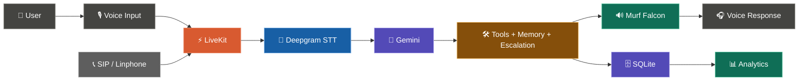

# 🩺 Aarogya Sahayak — Powered by Murf Falcon

A **Voice-First Health Access Assistant** built during the **Murf AI 10 Days of Voice Agents – #VoiceForBharat** challenge.

Aarogya Sahayak combines real-time voice AI, persistent memory, health-facility lookup, SIP calling, human escalation, agent handoff, analytics, and a dedicated dashboard.

**Languages:** Hindi • Hinglish • English

---

## 🛠️ Tech Stack

* ⚡ **LiveKit** — real-time voice transport
* 📝 **Deepgram** — Speech-to-Text
* 🧠 **Gemini** — reasoning / LLM
* 🔊 **Murf Falcon** — Text-to-Speech
* 🗄️ **SQLite** — database and persistence
* 📞 **SIP / Linphone** — telephony
* 🖥️ **Next.js / React** — frontend dashboard
* 🐍 **Python** — voice agent backend

---

## 🖥️ UI Preview


---

## ⚡ Architecture


---


---

# 🚀 My 10-Day Build Journey

The project evolved from a basic real-time voice agent into a complete **Health Access Voice Assistant** over 10 days.

---

## Day 1 — 🎙️ Voice Agent Foundation

Started by building the core real-time voice pipeline.

* Integrated **LiveKit** for real-time audio communication.
* Added **Deepgram STT** for converting speech into text.
* Added **Gemini** for reasoning and **Murf Falcon** for voice responses.
* Built the first working STT → LLM → TTS conversation flow.

---

## Day 2 — 🩺 Health Access Assistant

The generic voice agent was transformed into a health-focused assistant.

* Created the Health Access system prompt and conversation behavior.
* Added support for **Hindi, Hinglish, and English** interactions.
* Focused responses around health-access and assistance use cases.
* Improved the assistant's tone to be simple, conversational, and user-friendly.

---

## Day 3 — 🧠 Persistent Memory

Added memory so the assistant could remember useful user information.

* Implemented persistent user/profile facts.
* Stored useful information such as location and preferences.
* Connected memory (Sql-lite) with the voice-agent conversation.
* Reduced the need to repeatedly ask users for the same information.

---

## Day 4 — 👤 Personalized Conversations

Memory was connected more deeply with the agent's decision-making.

* The assistant could reuse stored user information during conversations.
* Added more personalized responses based on previous context.
* Reduced repetitive questions and improved conversation continuity.
* Prepared the memory layer for upcoming health-access tools.

---

## Day 5 — 🏥 Government Health Facility Lookup

Added a function tool to help users find nearby government health facilities.

* Added `find_nearest_health_facility(location_or_district)`.
* Integrated the official **data.gov.in** API with a local fallback dataset.
* Connected the tool with persistent memory so stored districts can be reused.
* Added safe handling so the agent never invents an unverified facility.

### 🌐 20 States / UTs Covered

1. Andhra Pradesh
2. Assam
3. Bihar
4. Chhattisgarh
5. Gujarat
6. Haryana
7. Himachal Pradesh
8. Jharkhand
9. Karnataka
10. Kerala
11. Madhya Pradesh
12. Maharashtra
13. Odisha
14. Punjab
15. Rajasthan
16. Tamil Nadu
17. Telangana
18. Uttar Pradesh
19. Uttarakhand
20. West Bengal

### Environment Variables

```env id="6w6h2d"
DATA_GOV_IN_API_KEY=your_data_gov_in_api_key_here
DATA_GOV_IN_RESOURCE_ID=9ef84268-d588-465a-a308-a864a43d0070
```

Example questions:

```text id="b9d9q3"
"Mere nearest government health centre kaunsa hai?"

"Mere district mein nearest PHC kahan hai?"
```

---

## Day 6 — 📞 Outbound SIP Calling

Extended the assistant from browser conversations to phone-based communication.

* Added **outbound SIP calling** using the LiveKit telephony flow.
* Added SIP / Linphone support for phone-based interactions.
* Reused the same Deepgram → Gemini → Murf Falcon pipeline.
* Prepared the system for real-world health-access calls and reminders.

Run:

```bash id="c2q6oa"
cd backend
uv run python src/outbound_call.py
```

---

## Day 7 — 🧑‍💼 Human Support Escalation

Added a safe human-support fallback for situations where AI should not continue alone.

* Added escalation detection and handling.
* Created a dedicated escalation workflow.
* The agent can inform users when human assistance is required.
* Prevents the assistant from guessing when a request needs human intervention.

Main backend file:

```text id="1af4lj"
backend/src/escalation.py
```

---

## Day 8 — 📊 Health Access Dashboard

Built a dedicated dashboard to monitor the voice-agent system.

* Added call and session activity.
* Added call status and outcome information.
* Added successful, failed, and escalated call views.
* Created a central interface for demonstrating and monitoring the project.

Global frontend styling:

```text id="5h0h7q"
frontend/app/style/global.css
```

---

## Day 9 — 🔄 Agent Handoff & Analytics

Added specialized agent handoff and analytics capabilities.

* Added **agent handoff** for requests that need a specialized agent.
* Added tracking for successful, failed, escalated, and outbound calls.
* Added analytics processing through `get_analytics.py`.
* Added a dedicated human-support interface for escalation workflows.

Important files:

```text id="7n1t5x"
backend/src/get_analytics.py
backend/src/escalation.py
frontend/app/human-support-cart.tsx
```

---

## Day 10 — 🚀Final Integration & Sharing the Journey

The final day focused on bringing the entire system together.

* Connected voice, memory, tools, SIP, escalation, handoff, and analytics.
* Tested the complete browser and telephony workflows.
* Refined the Health Access dashboard and user experience.
* Finalized the project documentation and prepared the complete demo.

### Final Voice Flow

```text id="n3o5f8"
👤 User
   ↓
🎙️ Voice Input
   ↓
⚡ LiveKit
   ↓
📝 Deepgram STT
   ↓
🧠 Gemini Reasoning
   ↓
🛠️ Tools + Memory + Escalation
   ↓
🔊 Murf Falcon TTS
   ↓
🎧 Voice Response
```

---

# ✨ Core Features

### 🎙️ Voice-First Interaction

Natural conversations in **Hindi, Hinglish, and English**.

### 🧠 Persistent Memory

Stores and reuses useful user context across conversations.

### 🏥 Health Facility Lookup

Uses government data with a local fallback for verified health-facility information.

### 📞 SIP Telephony

Supports outbound phone conversations through SIP / Linphone.

### 🧑‍💼 Human Escalation

Safely moves conversations to human support when required.

### 🔄 Agent Handoff

Transfers requests to specialized agents when necessary.

### 📊 Call Analytics

Tracks:

* Successful calls
* Failed calls
* Escalations
* Outbound calls
* Call outcomes

---

# 🗄️ Database

Aarogya Sahayak uses **SQLite** for lightweight application persistence.

It stores information required for:

* User/profile data
* Call information
* Escalation records
* Analytics-related data

Analytics processing:

```text id="f7t9kn"
backend/src/get_analytics.py
```

SQLite can later be migrated to PostgreSQL for larger-scale production deployment.

---

# 🧑‍💼 Human Support

### Backend Escalation

```text id="7n5x4z"
backend/src/escalation.py
```

Handles the logic for identifying and processing human-support escalation.

### Frontend Support UI

```text id="6f0j9n"
frontend/app/human-support-cart.tsx
```

Provides the interface for human-support workflows.

### Global Styling

```text id="w4g7te"
frontend/app/style/global.css
```

---

# ⚡ Why Murf Falcon

* **55ms model latency**
* **130ms time-to-first-audio**
* **$0.01/1000 characters**
* **150+ voices**
* **35+ languages**
* **99.38% pronunciation accuracy**

---

# 🛠️ Quickstart

## Prerequisites

* Python **3.10+**
* Node.js **18+**
* `uv`
* `pnpm`
* LiveKit project

### Install uv

```bash id="5g3f8c"
# macOS/Linux
curl -LsSf https://astral.sh/uv/install.sh | sh
```

Windows PowerShell:

```powershell id="2f4d8g"
powershell -ExecutionPolicy ByPass -c "irm https://astral.sh/uv/install.ps1 | iex"
```

### Install pnpm

```bash id="w7b2hx"
npm install -g pnpm
```

---

## 1. Clone the Repository

```bash id="e4n0d7"
git clone https://github.com/murf-ai/murf-livekit-starter.git
cd murf-livekit-starter
```

---

## 2. Environment Variables

Create `.env.local` in `backend/` and `frontend/`.

```env id="1w7d0v"
LIVEKIT_URL=your_livekit_url
LIVEKIT_API_KEY=your_livekit_api_key
LIVEKIT_API_SECRET=your_livekit_api_secret
MURF_API_KEY=your_murf_api_key
DEEPGRAM_API_KEY=your_deepgram_api_key
GOOGLE_API_KEY=your_google_api_key
```

For health facility lookup:

```env id="x4r3cm"
DATA_GOV_IN_API_KEY=your_data_gov_in_api_key
DATA_GOV_IN_RESOURCE_ID=9ef84268-d588-465a-a308-a864a43d0070
```

---

## 3. Install Backend

```bash id="7d2g5p"
cd backend
uv sync
```

---

## 4. Install Frontend

```bash id="j4v8n2"
cd frontend
pnpm install
```

---

## 5. Run the Project

### All-in-One

```bash id="p8z6jc"
# macOS/Linux
chmod +x start_app.sh
./start_app.sh

# Windows
.\start_app.ps1
```

### Or Run Separately

**Terminal 1 — LiveKit**

```bash id="s3d7hm"
livekit-server --dev
```

**Terminal 2 — Backend**

```bash id="f6x2jp"
cd backend
uv run python src/agent.py dev
```

**Terminal 3 — Frontend**

```bash id="k1w5zr"
cd frontend
pnpm dev
```

Open:

```text id="q8s2tm"
http://localhost:3000
```

Click **Start talking**, allow microphone access, and start the conversation.

---

# 📞 Run Outbound SIP

```bash id="9c7j4m"
cd backend
uv run python src/outbound_call.py
```

Flow:

```text id="8w4q9v"
📞 SIP / Linphone
      ↓
⚡ LiveKit
      ↓
🤖 Agent
      ↓
🧠 Gemini
      ↓
🔊 Murf Falcon
      ↓
🎧 Voice Response
```

---

# 🧪 Testing

Run backend tests:

```bash id="r2m8z6"
cd backend
uv run pytest
```

---

# 📁 Project Structure

```text id="3v8n1k"
aarogya-sahayak/
│
├── backend/
│   ├── src/
│   │   ├── agent.py
│   │   ├── outbound_call.py
│   │   ├── escalation.py
│   │   ├── get_analytics.py
│   │   └── ...
│   │
│   ├── tests/
│   ├── health_facilities.json
│   ├── database.sqlite
│   ├── .env.example
│   └── pyproject.toml
│
├── frontend/
│   ├── app/
│   │   ├── page.tsx
│   │   ├── human-support-cart.tsx
│   │   ├── api/
│   │   └── style/
│   │       └── global.css
│   │
│   ├── components/
│   ├── app-config.ts
│   ├── .env.example
│   └── package.json
│
├── start_app.sh
├── start_app.ps1
└── README.md
```

---

# ⚙️ Configuration

### Murf Falcon

Configured in:

```text id="3g8w5s"
backend/src/agent.py
```

```python id="k6y4c2"
tts=murf.TTS(...)
```

### Deepgram

```python id="4n8r2q"
deepgram.STT(model="nova-3")
```

### Gemini

```python id="5k2m9a"
llm=google.LLM(model="gemini-2.5-flash")
```

---

# 🚀 Deployment

The application can be deployed as two services:

### Backend — Railway

Configure:

```text id="6m3z9p"
MURF_API_KEY
DEEPGRAM_API_KEY
GOOGLE_API_KEY
LIVEKIT_URL
LIVEKIT_API_KEY
LIVEKIT_API_SECRET
```

### Frontend — Vercel

Configure:

```text id="9r5c2k"
LIVEKIT_URL
LIVEKIT_API_KEY
LIVEKIT_API_SECRET
AGENT_NAME
```

Both services must use the **same LiveKit project**.

---

# 🔮 Future Improvements

* 🗄️ SQLite → PostgreSQL for production scale
* 📞 Inbound SIP calling
* 🧑‍⚕️ More specialized health agents
* 📱 WhatsApp / SMS access
* 🌍 More regional languages
* 📊 Real-time analytics
* 🔐 Stronger authentication
* ☁️ Scalable cloud deployment

---

# 🔗 Links

* [Murf API Docs](https://murf.ai/api/docs)
* [Murf Voice Library](https://murf.ai/api/docs/voices-styles/voice-library)
* [LiveKit Docs](https://docs.livekit.io)
* [Deepgram Docs](https://developers.deepgram.com)
* [Murf Falcon Benchmarks](https://murf.ai/falcon/benchmarks)
* [TTS Latency Benchmarker](https://github.com/sahilsgupta/tts-latency-benchmarker)
* [Murf Discord](https://discord.gg/FbKAy96Sz7)

---

# 🏆 10-Day Journey at a Glance

| Day | Milestone                            |
| --- | ------------------------------------ |
| 1   | 🎙️ Voice Agent Foundation           |
| 2   | 🩺 Health Access Assistant           |
| 3   | 🧠 Persistent Memory                 |
| 4   | 👤 Personalized Conversations        |
| 5   | 🏥 Government Health Facility Lookup |
| 6   | 📞 Outbound SIP Calling              |
| 7   | 🧑‍💼 Human Support Escalation       |
| 8   | 📊 Health Access Dashboard           |
| 9   | 🔄 Agent Handoff + Analytics         |
| 10  | 🚀 Final Integration                 |

---

# 📄 License

MIT
